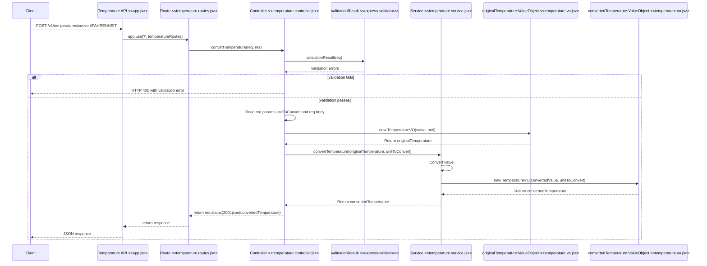

# Temperature Converter API

A small Express.js API project for temperature conversion workflows.

This project is built with Express.js, a fast and minimalist web framework for Node.js. For the official documentation, see: https://expressjs.com/

## Description

This project is intended to provide a simple temperature conversion API. The current implementation includes the project structure, route registration, controller/service delegation, a validation layer, and a value object model used by the API layer.

## Prerequisites

Before running the project, make sure you have installed:

- Node.js
- npm

## Installation

Install the project dependencies:

```bash
npm install
```

## Run the application

Start the app with:

```bash
npm start
```

For development with auto-reload:

```bash
npm run dev
```

## API endpoint

The current route is:

```http
POST /v1/temperatures/convert/:unitToConvert
```

Example:

```http
POST /v1/temperatures/convert/FAHRENHEIT
```

Request body example:

```json
{
  "value": 0,
  "unit": "CELSIUS"
}
```

Current response example for a request converting 0°C to Fahrenheit:

```json
{
  "value": 32,
  "unit": "FAHRENHEIT"
}
```

This route builds a temperature value object from the request body, validates the incoming request before reaching the controller, reads the target unit from the URL parameter, and delegates the actual conversion to the service layer.

## API documentation

Swagger UI is available at:

```http
http://localhost:3000/api-docs
```

The documentation is generated with `swagger-jsdoc` and served with `swagger-ui-express`.

## Path design rationale

The endpoint is structured as `/v1/temperatures/convert/:unitToConvert` for a few clear reasons:

- `/v1` defines the API version and keeps future versions isolated from current clients.
- `/temperatures` indicates the resource being handled.
- `/convert` describes the action being performed, which keeps the route expressive and easy to read.
- `:unitToConvert` captures the destination unit as part of the URL, making the conversion target explicit and easy to inspect without mixing it into the request body.

This path keeps the route semantic and predictable while preserving a clean separation of responsibilities: the route declares the endpoint and delegates business logic to the controller.

## Request flow



## Example conversions

- 0°C = 32°F
- 100°C = 212°F
- 32°F = 0°C
- 212°F = 100°C

## Validation layer

The API uses `express-validator` to validate incoming requests before they reach the controller.

The current validation rules ensure that:

- `value` is present and numeric
- `unit` is present and one of `CELSIUS` or `FAHRENHEIT`
- `unitToConvert` is present and one of `CELSIUS` or `FAHRENHEIT`

If any validation fails, the route returns HTTP 400 and prevents the controller from continuing with the conversion flow.

## Project structure

```text
.
├── app.js
├── src/
│   ├── routes/
│   │   └── temperature.routes.js
│   ├── controllers/
│   │   └── temperature.controller.js
│   ├── services/
│   │   └── temperature.service.js
│   ├── valueobjects/
│   │   └── temperature.vo.js
│   └── ...
├── __tests__/
│   └── services/
│       └── temperature.service.test.js
├── package.json
├── README.md
├── .gitignore
└── package-lock.json
```

## Run tests

```bash
npm test
```

## Run coverage

```bash
npm run coverage
```

## Notes

- The application currently uses Express.js.
- The route and value object structure are in place for further conversion logic.
- The project is intended to evolve into a full temperature conversion API with additional validation and service logic.
